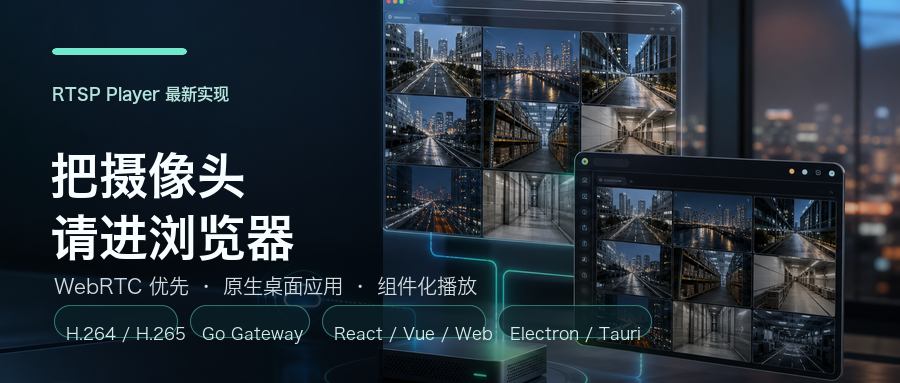
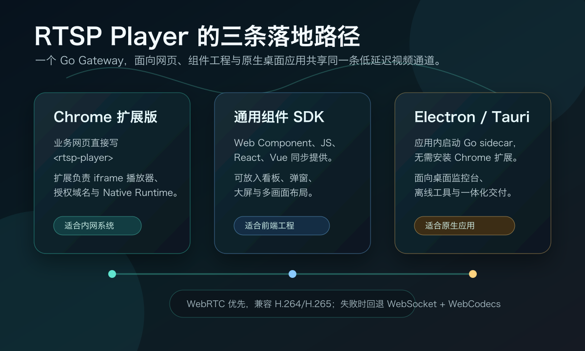

# 把 RTSP 摄像头请进浏览器：一个免费组件背后的低延迟旅程



有些需求，听起来轻得像一句话。

“能不能把摄像头画面放进网页里？”

真正落到项目中，它立刻变成一片辽阔的水域：RTSP、RTP、H.264、H.265、浏览器权限、本地进程、硬件解码、跨平台安装、企业内网、桌面应用，以及最终用户眼前那一块必须自然流动的画面。

这正是 **RTSP Player** 诞生的地方。

它希望把一件长久以来并不轻松的事情，重新变得优雅：让网页像写普通组件一样播放 RTSP 摄像头，让桌面应用不用插件也能原生播放，让业务系统不必为了“一路画面”搭起庞大的媒体平台。

更重要的是，它完全免费使用。  
如果你希望获得全部源码、完整仓库权限，以及后续永久更新，任意捐赠即可自助开通。没有固定金额，也不需要反复沟通，支持之后即可进入仓库，后续更新自然跟随。

## 那个长期存在的空白

RTSP 在现实世界里无处不在。

门店、仓库、园区、工厂、学校、物业、NVR 管理台、AI 标注系统、边缘设备控制台，都能看到它的身影。摄像头早已铺在现场，业务页面也早已运行在浏览器里，可两者之间，却始终隔着一道并不温柔的门槛。

浏览器不直接认识 `rtsp://`。  
网页不能随意打开 TCP 长连接去收 RTP 包。  
传统插件渐渐离场，旧式控件难以再进入现代系统。  
把 RTSP 转成 HLS，延迟会被拉长。  
搭建完整 WebRTC 媒体服务，链路、部署和维护又会变得沉重。  
引入 FFmpeg，能力固然丰盛，却也带来更大的安装包、更多进程管理和更复杂的跨平台细节。

市场中真正缺少的，是一种更贴近业务的答案：

页面仍然是页面，组件仍然是组件，本地只做靠近摄像头的薄薄一层桥接，浏览器负责最终解码与绘制。视频不用绕远路，内网画面不必送去云端，前端也不用背负一整座媒体系统。

RTSP Player 就是在这个空白里一点点长出来的。

## 最新版，已经不只是一个网页播放器

最初的版本聚焦在 Chrome 扩展与 WebCodecs。现在，它已经扩展成三条完整的落地路径。



第一条，是 **Chrome 扩展版**。

它适合企业内网、NVR 管理台、SaaS 控制台和需要统一管控的业务页面。页面写下 `<rtsp-player>`，Chrome 扩展负责加载播放器 iframe、唤起本地 Runtime、管理允许访问的业务域名。

第二条，是 **通用组件 SDK**。

它面向前端工程。Plain JS、Web Component、React、Vue 都已经准备好，预构建 SDK 也随包提供。你可以把它放进看板、弹窗、大屏、九宫格和设备详情页中，像使用普通 UI 组件那样组织视频画面。

第三条，是 **Electron / Tauri 原生桌面应用**。

它面向桌面监控台、内网工具和离线部署。应用内启动打包好的 Go sidecar，播放器走 `runtime="desktop"`，无需安装 Chrome 扩展，也不依赖浏览器外部环境。对于希望“一次安装，打开即用”的团队，这条路径尤其清爽。

## WebRTC 优先，WebCodecs 回退

这一版最大的变化，是默认选择了更短的视频道路。

RTSP Player 现在采用 **WebRTC 优先** 的传输策略。摄像头的 RTP 视频包进入本地 Go Gateway 后，优先通过 Pion WebRTC 走标准 WebRTC Track 转发给浏览器或桌面 WebView。浏览器能够处理 H.264，也在越来越多平台上开始具备 H.265 / HEVC 能力。

当 WebRTC 协商失败，或者短时间内没有收到可播放的视频轨道时，播放器会自动回到原先的 WebSocket + WebCodecs 路径。这个回退路径依旧保留：Go Gateway 将 H.264/H.265 整理为 Annex-B access unit，浏览器用 `VideoDecoder` 硬件优先解码，再绘制到 Canvas。

也就是说，新的默认策略并不是押宝某一种环境，而是先走最短路径，再根据能力自然切换：

```txt
优先：RTSP RTP → Go Gateway → WebRTC → 浏览器硬件解码

回退：RTSP RTP → Go Gateway → WebSocket Annex-B → WebCodecs → Canvas
```

这对于低延迟画面非常关键。每少一次封装，每少一层转码，每少一段排队，画面就离现场更近一步。

## H.264 与 H.265，各自走在合适的位置

H.264 依旧是今天网页播放的兼容基线。它的浏览器支持广，摄像头和 NVR 中也普遍存在。RTSP Player 对 H.264 做了完整处理：SDP track 解析、RTP Single NALU、STAP-A、FU-A、SPS/PPS 缓存、IDR 前参数集补齐、Annex-B 输出。

H.265 则属于正在打开的门。Chrome 新版本已经开始让 WebRTC HEVC 成为可能，但它仍然依赖操作系统、硬件、浏览器版本与桌面 WebView 能力。RTSP Player 对 H.265 增加了 SDP 解析、RTP payload metadata、VPS/SPS/PPS 处理和 WebRTC RTP 转发路径，但不会承诺所有机器都必然可用。

这也是项目选择“能力探测优先”的原因。能走 H.265 时，它可以为高分辨率画面节省带宽；不能走时，系统会回到 H.264 这条更宽阔的道路。

生产环境里，建议同时准备：

- H.265 或高码率 H.264 主码流，用于桌面与新浏览器环境。
- H.264 子码流，用于兼容回退与弱网络场景。

## 为什么依然没有选择 FFmpeg

FFmpeg 当然强大。它像视频世界里一座恢弘的图书馆，几乎什么格式都能找到答案。

但这个项目追求的，不是把所有视频能力搬进安装包，而是为 RTSP 摄像头播放找到一条轻巧、清晰、可嵌入的路径。

如果为了一路 RTSP 画面引入完整 FFmpeg，随之而来的会是更大的体积、更复杂的授权考量、更多进程细节，以及跨平台分发中不必要的重量。对许多业务团队来说，他们真正需要的不是一套媒体帝国，而是一块可以自然出现在页面里的摄像头画面。

所以 RTSP Player 的 Go 核心保持了非常克制的边界：

- Go 端核心链路不依赖第三方库。
- RTSP 拉流、RTP/H.264、RTP/H.265、WebSocket 输出由项目原生实现。
- WebRTC 模块作为可选能力，引入 Pion 这一条标准而成熟的道路。
- 不做转码，不做软件解码，不把问题交给庞大的外部进程。

这种选择让安装包更轻，让链路更短，也让运行时的行为更容易被理解和掌控。

## 那些曲折，藏在最终的安静里

一开始，Native Messaging 看起来像天然通道。Chrome 官方允许扩展启动本地 Host，也允许通过标准输入输出交换 JSON 消息。可视频帧不是普通消息，它们持续、密集、二进制，对时间格外敏感。

于是 Native Messaging 最终只承担启动和控制。真正的视频数据，走本机 `127.0.0.1` 上的 WebSocket 或 WebRTC。控制面保持官方、安全、可管理；数据面则获得足够舒展的空间。

后来，Go Native Host 的生命周期也经历过反复。Chrome 的 `sendNativeMessage` 更适合一次请求与一次回应，如果本地 Host 长时间停留，浏览器侧就可能陷入等待。最后的结构变成了短进程 Host 唤起常驻 Gateway daemon，分工清楚，行为也更可预期。

再后来，是安装体验。

普通用户不应该被迫理解 Native Messaging manifest、扩展 ID、二进制路径和系统权限。于是项目做了 macOS、Windows、Linux 三端图形安装入口：macOS 打开 DMG 运行 `RTSP Installer.app`，Windows 解压后运行 `RTSP Installer.hta`，Linux 提供 `.desktop` 与 `install-gui.sh`。安装器按系统语言显示中文或英文，复制 Runtime，准备扩展目录，注册 Native Host，并打开 Chrome 扩展页。

这些曲折最后并不会出现在用户眼前。用户只会看到一个简洁的安装助手，以及一块开始流动的视频画面。

## 真实画面，不是想象中的演示

下面这张图来自公开 RTSP 源的真实端到端验证。页面收到播放器 ready 事件，解码器进入可用状态，H.264 画面被浏览器解码后绘制出来。


验证中可以看到：

- H.264 codec 为 `avc1.4D401E`。
- 画面约 30 fps。
- 播放队列保持在 0 附近。
- Canvas 获得真实视频帧，而不是静态占位图。
- 当前公开源验证了 H.264 链路，H.265 建议使用自有摄像头或 NVR 做平台能力验收。

流畅度的秘密并不玄妙。它来自每一层的节制：RTSP 使用 TCP interleaved，避免复杂网络中的 UDP 不确定性；WebRTC 优先转发 RTP，不做转码；WebSocket 回退输出二进制 Annex-B，减少文本膨胀；WebCodecs 请求硬件优先；播放队列不让旧帧无止境堆积。

当系统不再把时间消耗在不必要的搬运和包装上，画面自然会轻盈许多。

## 一眼看见能做什么

如果你正在做下面这些系统，RTSP Player 很可能正好落在需求中央：

- 门店、仓库、园区、工厂的实时预览。
- NVR 管理台和设备运维后台。
- AI 标注平台、算法调试台和边缘设备控制台。
- 物业、安防、巡检、生产现场的大屏页面。
- SaaS 平台中需要访问客户本地摄像头的业务页面。
- React、Vue 前端工程中的多画面卡片、弹窗预览和详情页。
- Electron / Tauri 桌面监控台与离线交付工具。
- 小米、米家摄像头通过 miiot/micam 桥接为 RTSP 后进入统一播放页面。

对小米摄像头，最新文档已经改为推荐使用 [miiot/micam](https://github.com/miiot/micam) 做本地桥接。它通过 Miloco、go2rtc 和 micam，把摄像头画面转推为局域网 RTSP，例如：

```txt
rtsp://桥接主机IP:8554/mi_camera_1
```

随后就可以直接交给 RTSP Player：

```html
<rtsp-player
  runtime="auto"
  transport="auto"
  codec="auto"
  url="rtsp://192.168.31.10:8554/mi_camera_1"
  autoplay
  controls>
</rtsp-player>
```

## 它现在已经覆盖的能力

为了让读者快速判断是否适合自己的项目，这里把当前能力放在一起。

已经支持：

- Chrome MV3 扩展接入。
- `<rtsp-player>` Web Component。
- 独立 JS SDK。
- React 组件。
- Vue 组件。
- Electron 桌面打包方案。
- Tauri v2 sidecar 桌面打包方案。
- 三端图形安装器。
- RTSP over TCP interleaved。
- RTSP Basic / Digest 鉴权。
- H.264 SDP 与 RTP depay。
- H.265 SDP 与 RTP metadata。
- WebRTC-first 传输。
- Pion WebRTC 可选模块。
- WebSocket Annex-B 回退。
- WebCodecs 硬件优先解码。
- Canvas 渲染。
- 播放状态、fps、queue 统计。
- 本地 Gateway 只监听 `127.0.0.1`。
- Native Host secret、一次性 stream token、origin 授权。

当前边界：

- 不做转码。
- 不做软件解码。
- 暂不包含音频。
- UDP RTP 不是当前优先路径。
- H.265 依赖浏览器、系统和硬件能力，需要实际设备验证。

这些边界并不是退让，而是有意为之。项目希望把“播放 RTSP 摄像头”这件事做得轻盈、透明、可维护，而不是把所有视频平台能力一股脑塞进来。

## 免费使用，源码与更新自助开通

RTSP Player 会保持完全免费使用。你可以把它用于学习、验证、内网试点和业务集成。

如果你希望获得全部源码、私有源码仓库权限和后续永久更新，任意捐赠即可自助开通。支持后即可进入仓库，后续 WebRTC、桌面应用、安装器、文档与兼容性改进都会持续同步，省心，也坦然。

项目主页与在线 Demo：

[https://rtsp.flyfish.dev](https://rtsp.flyfish.dev)

公开仓库与安装包 Release：

[https://github.com/flyfish-dev/rtsp](https://github.com/flyfish-dev/rtsp)

小米 / 米家 micam 桥接教程：

[https://rtsp.flyfish.dev/docs/xiaomi-rtsp.md](https://rtsp.flyfish.dev/docs/xiaomi-rtsp.md)

| 客服联系 | 微信打赏 | 支付宝打赏 | 公众号 |
| --- | --- | --- | --- |
|  |  |  |  |

## 写在最后

许多工程难题，并不缺少宏大的答案。它们缺少的是恰到好处的答案。

RTSP Player 想做的，就是让一条摄像头画面从现场走进浏览器时，不必穿过漫长的云端转发，不必拖着沉重的转码进程，也不必回到旧式插件的年代。

它让业务页面重新变得清爽，让桌面应用获得原生交付的自由，让摄像头视频以一种现代、轻巧、可掌控的方式出现在用户眼前。

当画面终于在浏览器里自然展开，背后的协议、分片、鉴权、参数集、WebRTC 协商和解码队列都安静退场。

用户看到的是画面。  
开发者留下的是余裕。  
而这，正是一件好工具最动人的地方。
